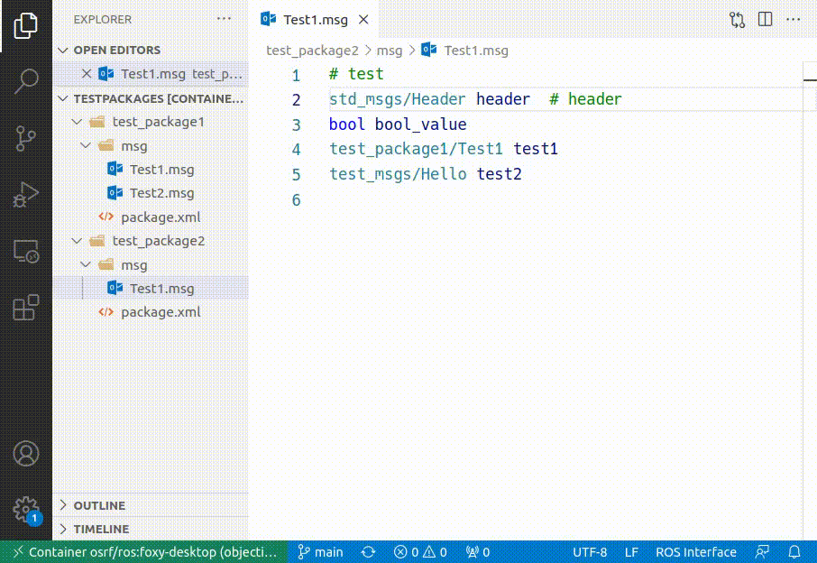

# vscode-ros2

VSCode extension for Robot Operation System 2 (ROS2).

## Features

- Syntax highlighting for ros2 interface files (`.msg`, `.srv`, `.action`)
- Language support for ros2 interface files
  - Find the definition of the message type

